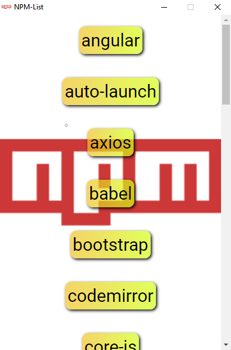

# NPM-List
This is a Electron app
----------------------



### This app tells you your installed packages.

How to Use?
-----------

create an electron app and copy files in your project
```diff
+ install shelljs
```
###### *This is not good in Web
